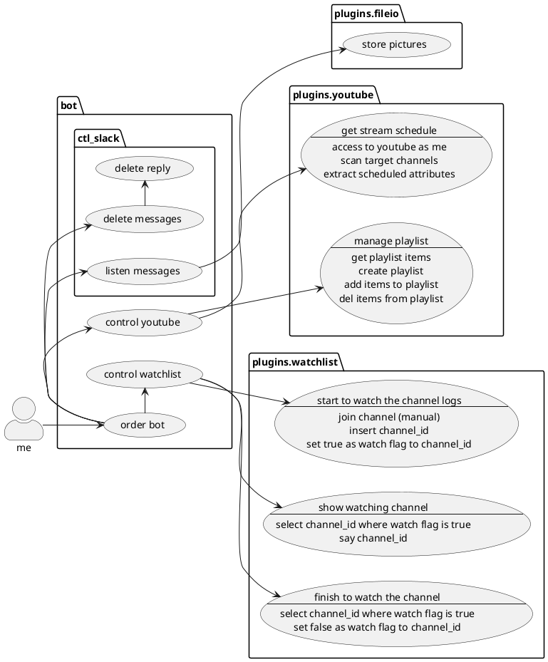

# 設計書

v2で動的ロード機能をつけるために機能整理が必要

## coding rules

- 本書は、Visual Studio Codeで記述する。
- UML図は、PlantUMLによって作成する。
- プラグインは少なくとも以下の2つを導入する
   - plantuml
   - markdown preview enhanced
- PlantUMLで表示するためには、brewで以下のソフトを導入する
   - `brew install plantuml`
   - `brew install graphviz`
- PDF出力のためにはGoogle Chromeを導入する
- markdown preview enhancedで埋め込みUMLを表示するには、
  `Markdown-preview-enhanced: Plantuml Jar Path`へ`plantuml.jar`を指定する

## classes



## ファイル構成

release-1.0 時点

```
/sui-chan.py             --- main 
   |
   +-- msgs.py           --- セリフと乱択
   |
   +-- msgprocessing.py  --- slackのmsg処理
   |
   +-- watch_list.py     --- 監視対象chの管理
   |
   +-- youtu.py          --- youtubeのAPI処理
   |
   +-- userprocessing.py
   |
   +-- dump_log.py       --- ログ出力関数
   |
   +-- mylogger.py       --- ロガー定義
```

## 新ファイル構成案

```
/sui-chan.py
   |
   +-- plugins/    --- ここの *.py をロード
```
